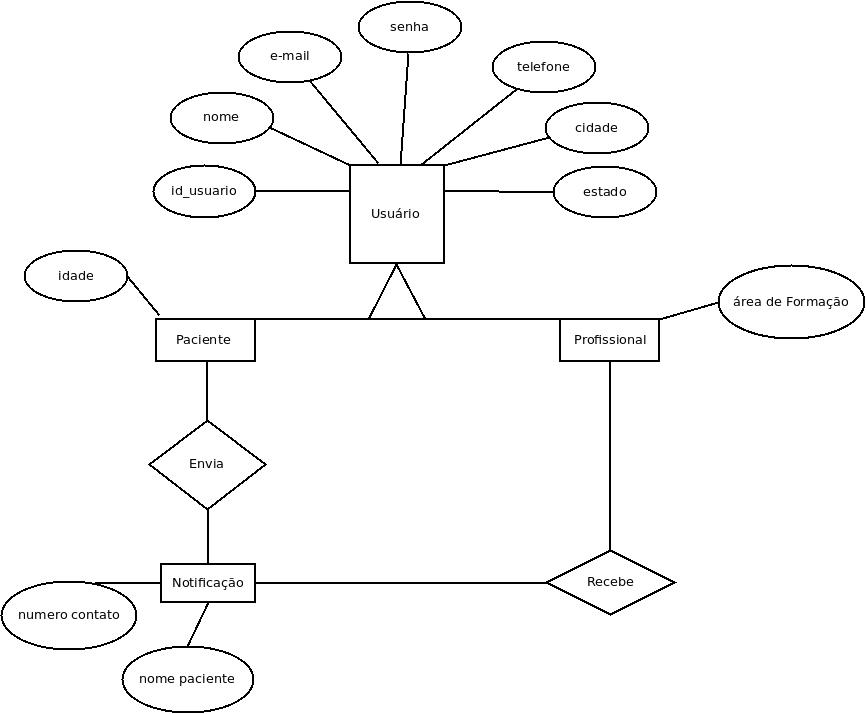

## Histórico de Versões
| Versão  |  Data  | Autor  |  Descrição  |
| ------------------- | ------------------- | ------------------- | ------------------- |
|  1.0 |  11/09/2021 | @GeiseSaunier |  Criação do documento de visão |
|  1.1 |  11/09/2021 | @GeiseSaunier e @IanoMaciel |  Inserção dos requisitos funcionais, não funcionais e regras de negócio |
| 2.0  |  11/09/2021 | @GeiseSaunier e @IanoMaciel |  Documento de Arquitetura |
|   |   |   |   |
|   |   |   |   |
|   |   |   |   |
|   |   |   |   |
|   |   |   |   |
|   |   |   |   |
|   |   |   |   |
|   |   |   |   |
|   |   |   |   |

## Sumário
1.  **Introdução**
- 1.1. Propósito do Documento de Requisitos
- 1.2. Público Alvo
2.  **Descrição Geral do Produto**
- 2.1. Situação Atual
- 2.2. Escopo
- .3. Atores
3. **Requisitos**
- 3.1 Requisitos Funcionais
- 3.2 Requisitos Não Funcionais
4. **Regras de Negócio**
- 4.1 Restrições de Software
- 4.2 Arquitetura de Software - Modelo-Visão-Controlador (MVC)
- 4.3 Identificação dos Casos de Uso
- 4.4 Diagrama de Casos de Uso
- 4.5 Diagrama de Classes
- 4.6 Diagramas de Sequência
- 4.7 Diagramas de Estados
- 4.8 Diagrama de Objetos
- 4.9 Diagrama de Atividades
- 4.10 Diagrama de Componentes
- 4.11 Diagrama de Pacotes
- 4.12 Diagrama de Comunicação
5. **Diagrama Entidade Relacionamento**
6. **Modelo Lógico**
7. **Projeto Interface**
- 7.1 Baixa Fidelidade
- 7.2 Alta Fidelidade
8. **Referências**

### 1.  Introdução

**1.1  Propósito do Documento de Requisitos**  
Esse documento tem o objetivo de detalhar os requisitos dos usuários que deverão ser atendidos pelo sistema a ser construído nesse projeto. Ele servirá como base para a construção do sistema por parte dos programadores. 
Aqui estará presente uma descrição detalhada das funções do produto, de suas interfaces e do comportamento esperado do sistema. 

**1.2  Público Alvo**  
Este documento destina-se aos stackholders (arquitetos de software, engenheiros de software, testadores e usuários classificados como usuários fornecedores).

### 2. Descrição Geral do Produto

Com intuito de facilitar a descrição do aplicativo, será utilizada neste documento a metodologia 5W2H que abordará algumas nuances do produto como do que se trata, a quem se destina, entre outros aspectos que caracterizam o aplicativo AUTIZANDO.

**O que é**

O AUTIZANDO tem o propósito de tornar a consulta de pessoas portadoras do Transtorno do Espectro Autista - TEA  acessível e ágil, concentrando todas as informações necessárias para encontrar o especialista mais próximo em um único aplicativo. 
A ferramenta trata-se de um aplicativo mobile, onde poderão ser cadastrados pessoas portadoras do TEA e profissionais especialistas em diversas áreas, como por exemplo psiquiatra, psicólogo, etc. Além disso, o autista e o profissional deverão inserir sua localidade, para que assim o autista possa ser atendido por aquele mais próximo.

**Para quem e onde**

A ferramenta está sendo conceitualizada, desenvolvida, em breve implementada, testada e lançada por dois alunos da Universidade Federal do Amazonas, em parceria com uma portadora do TEA, chamada Carolina, junto a Bianca, advogada especialista em propriedade intelectual, mais especificamente em registro de Software, mãe de um autista de 08 anos; para todos aqueles que necessitam de atendimento médico específico e ainda encontram dificuldade de localizar um profissional.

**Por quê**

O AUTIZANDO vem com um objetivo de preencher um gap que é a dificuldade do autista em em encontrar profissionais mais próximos e disponíveis para atendimento.

**Quando utilizar**

O aplicativo vem com a proposta de ser utilizada a qualquer momento desde que o autista e/ou o responsável por ele deseje localizar um profissional e agendar um atendimento.

**Como será utilizada**

O Autizando possuirá dois usuários ativos: o especialista e o austista. O especialista deverá inserir alguns dados específicos, como por exemplo, nome, email, número para contato, cidade-estado, área de formação-atuação e informar se tem experiência com pessoas portadoras do TEA. Em paralelo a isso, o autista deverá  inserir nome, cidade-estado, email, telefone, idade, o que busca, se é diagnóstico, profissional de psiquiatria, neurologista, se já foi diagnosticado e se tem plano de saúde. Através desses dados, por meio de um recurso de geolocalização, o aplicativo redirecionará o autista para um profissional mais próximo.

**Quanto custará**

O aplicativo será de uso gratuito.

**2.1  Situação Atual**

Atualmente, o cadastro de profissionais e autistas é realizado através do preenchimento de um formulário e, manualmente, a pessoa verifica a necessidade do autista e o profissional disponível para atendê-lo. 

**2.2  Escopo**

| Num  |  Módulo  | Descrição |  
| ------------------- | ------------------- | ------------------- | 
|  1 |  Aplicativo  | Será desenvolvido um aplicativo mobile capaz de atender aos sistemas operacionais iOS e Android. | 

**2.3 Atores** 
O sistema possui dois tipos de atores, sendo eles:     
   - Usuário portador do TEA (Autista);      
   - Usuário Especialista (Profissional da saúde);

| Num  |  Ator  | Definição e Privilégio de Acesso e Segurança |  
| ------------------- | ------------------- | ------------------- | 
|  1 |  Usuário Autista | Terá a opção de localizar o profissional mais próximo e enviar uma notificação para tentar uma possível consulta |
|  2 |  Usuário Especialista | Receberá a notificação do autista mais próximo, com nome e número de telefone, e em seguida entrará em contato pelo número disponibilizado |

### 3. Requisitos

**3.1 Requisitos Funcionais**

|ID| Descrição| Prioridade|
|--------|--------|--------|
|  RF 01  |  O sistema deve permitir ao usuário autista realizar o cadastro de suas informações no aplicativo |  Essencial |
|  RF 02  |  O sistema deve permitir ao usuário especialista realizar o cadastro de suas informações no aplicativo |  Essencial |
|  RF 03  |  O sistema deve permitir ao usuário autista editar suas informações no aplicativo |  Essencial   |
|  RF 04  |  O sistema deve permitir ao usuário especialista editar suas informações no aplicativo   |  Essencial   |
|  RF 05  |  O sistema deve permitir ao usuário autista excluir suas informações do aplicativo |  Essencial   |
|  RF 06  | O sistema deve permitir ao usuário especialista excluir suas informações do aplicativo   |  Essencial |
|  RF 07  |  O sistema deve permitir ao usuário autista localizar o especialista mais próximo |  Essencial   |
|  RF 08  |  O sistema deve permitir ao usuário autista enviar uma notificação ao especialista mais próximo|  Essencial   |
|  RF 09  |  O sistema deve permitir um perfil específico ao usuário autista  |  Essencial   |
|  RF 10  |  O sistema deve permitir um perfil específico ao usuário especialista |  Essencial   |

**3.2 Requisitos Não Funcionais**

|ID| Descrição| Prioridade|
|--------|--------|--------|
| RF 01| Os dados dos usuários clientes serão gravados no sistema de banco de dados utilizando criptografia de dados SHA3.| Segurança |
| RF 02| O sistema deve ser desenvolvido para mobile.| Interoperabilidade |
| RF 03| O sistema deve dispor de design responsivo.| Usabilidade |
| RF 04| O sistema deve utilizar o padrão UML 2.0 para a documentação.| Padrões |
| RF 05| O sistema deve utilizar a linguagem de programação Javascript, aliado ao framework React Native com o auxílio do expo.| Portabilidade |
| RF 06| A interface do sistema deve ser de fácil manipulação.| Usabilidade | 
| RF 08| Os dados do usuário cliente serão trafegados no sistema de banco de dados utilizando criptografia de dados SHA3. | Segurança |

### 4. Regras de Negócio

| Num | Requisito Associado | Nome da RN| Descrição |
| ---- | ----| ----| ----
| RN 01 | RF 01 | Cadastro do usuário autista| Um usuário autista só poderá ser cadastrado se informar: nome, e-mail, telefone, cidade, estado, idade e uma senha |
| RN 02 | RF 02 | Cadastro do usuário especialista | Um usuário especialista só poderá ser cadastrado se informar: nome, e-mail, telefone, cidade, estado, área de formação e uma senha |
| RN 03 | RF 07 | Localizar especialista | Um usuário poderá localizar o especialista mais próximo, de acordo com a localização informada. Se houver especialista, o aplicativo deverá apresentar as opções. Caso contrário, deverá ser enviada a seguinte mensagem: "não encontramos profissionais próximos a você" |
| RN 03 | RF 08 | Enviar notificação ao especialista | Após localizar o especialista mais próximo, o usuário deve ter a opção de enviar uma notificação a ele, com nome e número de contato, para que o especialista possa entrar em contato com ele, no tempo mais adequado a sua rotina diária |

**4.1 Restrições de Software**

| Num | Restrição |
| ---- | ----|
| 1 | O aplicativo poderá ser acessado por usuários do Sistemas Operacionais Android e IOS |

**4.2  Identificação dos Casos de Uso**

**4.3  Diagrama de Casos de Uso**

**4.4  Diagrama de Pacotes**

**4.5  Diagramas de Sequência**

### 5. Diagrama Entidade Relacionamento

